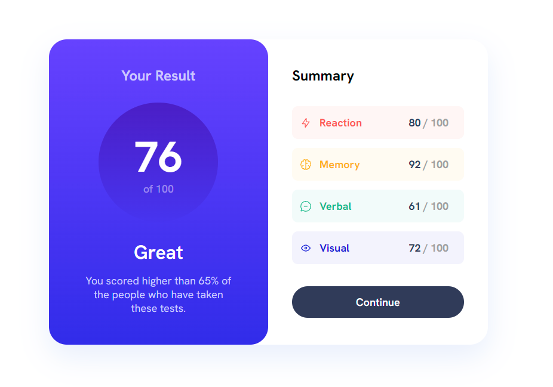
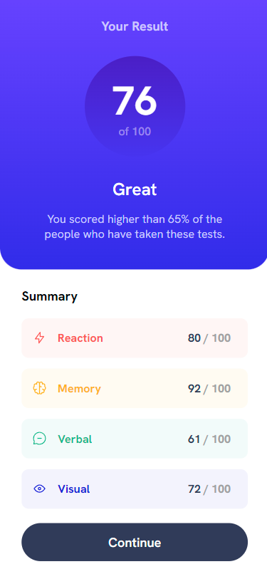

# Frontend Mentor - Results summary component solution

This is a solution to the [Results summary component challenge on Frontend Mentor](https://www.frontendmentor.io/challenges/results-summary-component-CE_K6s0maV). Frontend Mentor challenges help you improve your coding skills by building realistic projects. 

## Table of contents

- [Overview](#overview)
  - [The challenge](#the-challenge)
  - [Screenshot](#screenshot)
  - [Links](#links)
- [My process](#my-process)
  - [Built with](#built-with)
  - [What I learned](#what-i-learned)
- [Author](#author)

**Note: Delete this note and update the table of contents based on what sections you keep.**

## Overview

### The challenge

Users should be able to:

- View the optimal layout for the interface depending on their device's screen size
- See hover and focus states for all interactive elements on the page
- **Bonus**: Use the local JSON data to dynamically populate the content

### Screenshot




### Links

- GitHub Live Site URL: [GitHub Page](https://anthob-dev.github.io/FrontendMentor-endScorePage/)

## My process

I started by creating a sketch in Figma based on the provided .png images in the project folder. Then, I worked on the HTML and CSS, ensuring responsiveness, and finally, I used JavaScript to dynamically populate the content.

### Built with

- HTML5
- CSS3
- JavaScript

**Note: These are just examples. Delete this note and replace the list above with your own choices**

### What I learned

I learned how to use async functions in JS :

```js
async function fetchData() {
  try {
    const response = await fetch("data.json");
    if (!response.ok) {
      throw new Error("Json not loaded.");
    }
    const data = await response.json();
    printData(data);
  } catch (error) {
    console.error("Error has occured :", error);
  }
}
```

If you want more help with writing markdown, we'd recommend checking out [The Markdown Guide](https://www.markdownguide.org/) to learn more.

**Note: Delete this note and the content within this section and replace with your own learnings.**

## Author

- GitHub - [AnthoB-Dev](https://github.com/AnthoB-Dev/)
- Frontend Mentor - [@AnthoB-Dev](https://www.frontendmentor.io/profile/AnthoB-Dev)